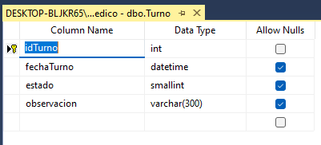

# Máster en SQL Server: Desde Cero a Nivel Profesional 2023
## Práctica 1

- [Máster en SQL Server: Desde Cero a Nivel Profesional 2023](#máster-en-sql-server-desde-cero-a-nivel-profesional-2023)
  - [Práctica 1](#práctica-1)
        - [¿Qué son los archivos MDF y LDF?](#qué-son-los-archivos-mdf-y-ldf)
  - [Diseñador de tablas](#diseñador-de-tablas)
      - [Modificaciones](#modificaciones)
      - [Establecer una Primary Key](#establecer-una-primary-key)
      - [IDENTITY](#identity)
  - [T-SQL (Transact SQL)](#t-sql-transact-sql)
  - [Tabla de historias clínicas 1](#tabla-de-historias-clínicas-1)
  - [Tabla de historias clínicas 2](#tabla-de-historias-clínicas-2)
  - [Tabla País](#tabla-país)
  - [Tabla Turno](#tabla-turno)
  - [Tabla Turno-Paciente](#tabla-turno-paciente)
      - [¿Por qué en una tabla de relación NO se establece la propiedad IDENTITY?](#por-qué-en-una-tabla-de-relación-no-se-establece-la-propiedad-identity)
  - [Tabla Turno Estado](#tabla-turno-estado)
  - [Tabla Especialidad](#tabla-especialidad)
  - [Tabla Pago](#tabla-pago)

Se crea una nueva DATABASE llamada CentroMedico.
Se recomienda crearla sobre una nueva partición o una carpeta diferente para luego facilitar el Back-Up de la información.

Se generan dos archivos. .MDF (la base de datos) y .LDF (el Log, las transacciones que se han hecho)

[Subir](#top)
##### ¿Qué son los archivos MDF y LDF?
Archivo MDF (Master Data File): El archivo MDF es el principal archivo de datos de una base de datos en SQL Server. Contiene las tablas, índices, procedimientos almacenados y otros objetos de la base de datos.

Archivo LDF (Log Data File): El archivo LDF es el archivo de registro de transacciones de una base de datos en SQL Server. Registra todas las transacciones y cambios realizados en la base de datos, lo que permite la recuperación y la restauración de la misma en caso de fallos o pérdida de datos.

Al abrir un New Query (CTRL+N), por defecto se abre apuntando a "master", que es el sistema general del SQL Server. Para hacer que por defecto se abra sobre una BD, en el *Object Explorer* se despliega la carpeta  *Security*, luego carpeta *Logins* y sobre el usuario **sa**, se abren sus opciones; en la ventana que se abre, al final de la página se puede cambiar la opción de *Default Database*.

[Subir](#top)
## Diseñador de tablas
En el *Object Explorer*, se selecciona la base de datos Centro Medico, se da clic derecho sobre la carpeta *Tables* y *New* - *Table*.

Se abre un creador de tablas con tres campos:
- Column name
- Data Type
- Allow Nulls

Una buena práctica al definir el nombre de campos con varias palabras, es una *Camel Case* de la forma id**P**aciente

Se crea la siguiente tabla para los pacientes. El país se dejará como un campo de 3 dígitos en codificación internacional.

Al darle guardar, se llama la tabla como **paciente**. Se recomienda usar el singular de los elementos.

Se evidencia que al guardar la tabla como **dbo.Paciente**

[Subir](#top)
#### Modificaciones
Al dar clic derecho en una tabla, se selecciona *Design*. A través de esta opción es posible cambiar la configuración de una tabla.
En este caso, cambiarmos el campo *Allow nulls*

Al intentar guardar estos cambios, por defecto se muestra la siguiente ventana de prevención.

Para quitar esta alerta, desde el menú *Tools*, luego en *Options* y en las opciones de *Designers* -> *Table and Database Designers*, se **des**marca la opción *Prevent saving changes that require table re-creation*

Se da guardar de nuevo y ya no saldrá la ventana de advertencia.

[Subir](#top)
#### Establecer una Primary Key

Al abrir el *Design*, se selecciona el campo deseado y en la barra de menú se da clic sobre el ícono de una llave.

Antes de:

Luego de crearla, se evidencia como se deshabilita automáticamente el campo de *Allow nulls*, pues todo campo deberá tener una PK. Al frente del nombre de la columna, se ha creado una llave amarilla.

En el *Object Explorer* se crea en la carpeta de *Keys*, la llave de paciente, de la forma **PK_Paciente**, un nombre que SQL Server le da por defecto.

[Subir](#top)
#### IDENTITY

Al abrir el *Design*, en el campo idPaciente, en la parte inferior en las *Column Properties*, se expande y se cambie la opción *(Is Identity)* a *Yes*, y se cambia el *Increment* y el *Seed*.

Esto solo se puede ajustar en campos de tipo **numérico** como INT.

[Subir](#top)
## T-SQL (Transact SQL)

Se abre una ventana de *New Query*

Es posible crear desde allí una nueva DataBase

~~~
CREATE DATABASE EJEMPLO;

CREATE TABLE Paciente1(
    idpaciente int NOT NULL,
    nombre varchar(50) NOT NULL,
	apellido varchar(50) NULL,
	fnacimiento date NULL,
	domicilio varchar(50) NULL,
	idpais CHAR(3) NULL,
	telefono VARCHAR(20) NULL,
	email varchar(30) NULL,
	observacion varchar(1000) NULL,
	fechaAlta datetime NOT NULL,
	CONSTRAINT PK_idpaciente PRIMARY KEY (idpaciente)
);
~~~

[Subir](#top)
## Tabla de historias clínicas 1
[Recursos de la clase](./RecursosCurso/S05.CREATE_TABLE_Historia.sql)

Se crea la tabla de historias clínicas. Se recuerda que por la normalización, se creará una tabla intermedia para los turnos.

[Subir](#top)
## Tabla de historias clínicas 2
[Recursos de la clase](./RecursosCurso/S05.CREATE_TABLE_HistoriaPaciente.sql)

Se crea la tabla para relacionar el médico y el paciente a través de una historia clínica.

Con CTRL se seleccionan varios campos a la vez. Con estos seleccionados es posible crear PRIMARY KEY **COMPUESTA**. Lo que esto quiere decir, es que no es que una tabla tenga varias PRIMARY KEY, lo que significa es que tiene **una PK** creada a partir de los campos que se seleccionen para ser PK.

[Subir](#top)
## Tabla País
[Recursos de la clase](./RecursosCurso/S04.CREATE_TABLE_Pais.sql)

EJERCICIO: Crear la tabla Pais
Deberás crear la tabla Pais, que guardará los países de orígen de los pacientes.
Deberá contar solo con 2 campos, idPais y Pais, cuyos tipos de dato deben ser CHAR(3) y VARCHAR(30) respectivamente.
La Primary Key deberá ser el campo idPais.
Nota: La codificación internacional de países tiene 3 caracteres (ARG, ESP, PER, COL, MEX)
Aprovecha esa codificación para crear la Primary Key de la tabla.
Recuerda: No dudes en consultar cualquier duda que tengas.
Adjuntamos el script, solo para que puedas verificar el ejercicio realizado.

[Subir](#top)
## Tabla Turno
[Recursos de la clase](./RecursosCurso/S05.CREATE_TABLE_Turno.sql)

Para esta tabla se aprovecha el tipo SMALLINT, dado que se espera que la cantidad de "estados" no sea muy elevado. Se gana espacio en memoria.

[Subir](#top)
## Tabla Turno-Paciente
[Recursos de la clase](./RecursosCurso/S05.CREATE_TABLE_TurnoPaciente.sql)

Turno - Paciente - Médico

[Subir](#top)
#### ¿Por qué en una tabla de relación NO se establece la propiedad IDENTITY?

En tablas como Turno-Paciente, los registros derivados de otras tablas.
Los valores que estos valores tomen, DEBEN existir previamente, en la tabla padre.

[Subir](#top)
## Tabla Turno Estado
[Recursos de la clase](./RecursosCurso/S05.CREATE_TABLE_TurnoEstado.sql)

EJERCICIO: Crear la tabla TurnoEstado
Deberás crear la tabla TurnoEstado, que guardará los estados posibles de un turno y que luego haremos la relación o restricción con la tabla Turno.
Deberá contar solo con 2 campos, idEstado y Descripción, cuyos tipos de dato deben ser SMALLINT y VARCHAR(50) respectivamente.
La Primary Key deberá ser el campo idEstado.
Adjuntamos el script, solo para que puedas verificar el ejercicio realizado.

[Subir](#top)
## Tabla Especialidad
[Recursos de la clase](./RecursosCurso/S04.CREATE_TABLE_Especialidad.sql)

EJERCICIO: Crear la Tabla Especialidad
Deberás crear la tabla Especialidad, que guardará las especialidades de los Médicos.
Deberá contar solo con 2 campos, idEspecialidad y Especialidad, cuyos tipos de dato deben ser INT y VARCHAR(30) respectivamente.
La Primary Key deberá ser el campo idEspecialidad y además deberá tener la propiedad IDENTITY activada.
Recuerda: No dudes en consultar cualquier duda que tengas.
Adjuntamos el script, solo para que puedas verificar el ejercicio realizado.

[Subir](#top)
## Tabla Pago
[Recursos de la clase](./RecursosCurso/S05.CREATE_TABLE_Pago.sql)

A través de T-SQL se crea esta tabla. Ver la sintaxis de la PK para, en la misma línea, definir que será la PK y que tendrá IDENTITY activado.

~~~
CREATE TABLE Pago(
	idpago INT IDENTITY(1,1) NOT NULL PRIMARY KEY,
	concepto TINYINT NOT NULL,
	fecha datetime NOT NULL,
	monto money NOT NULL,
	estado tinyint NOT NULL,
	obs varchar(1000)
);
~~~

Al ejecutar este código, se crea la siguiente tabla:

