
# Máster en SQL Server: Desde Cero a Nivel Profesional 2023

- [Máster en SQL Server: Desde Cero a Nivel Profesional 2023](#máster-en-sql-server-desde-cero-a-nivel-profesional-2023)
  - [Códigos de GIT usados](#códigos-de-git-usados)
  - [Secciones 1 y 2. Introducción, instalación y SETUP](#secciones-1-y-2-introducción-instalación-y-setup)
    - [Instalación de SQL Server](#instalación-de-sql-server)
    - [Verificar la correta instalación de SQL Server](#verificar-la-correta-instalación-de-sql-server)
    - [Instalación de SQL Server Management Studio (SSMS)](#instalación-de-sql-server-management-studio-ssms)
    - [Conexión al motor SQL](#conexión-al-motor-sql)
    - [Conociendo Microsoft SQL Management Studio](#conociendo-microsoft-sql-management-studio)
    - [Atajos de teclado más utilizados](#atajos-de-teclado-más-utilizados)
      - [General](#general)
      - [Navegación y edición](#navegación-y-edición)
      - [Resultados y cuadrícula](#resultados-y-cuadrícula)
  - [Sección 3. Fundamentos y Estructura de Base de Datos](#sección-3-fundamentos-y-estructura-de-base-de-datos)
    - [Valor NULL](#valor-null)
    - [Primary Key (PK)](#primary-key-pk)
    - [Foreign Key (FK)](#foreign-key-fk)
    - [Propiedad IDENTITY](#propiedad-identity)
    - [Normalización de tablas](#normalización-de-tablas)
      - [Primera 1FN](#primera-1fn)
      - [Segunda 2FN](#segunda-2fn)
      - [Tercera 3FN](#tercera-3fn)
    - [Tipos de datos](#tipos-de-datos)
  - [Sección 5. Relaciones y Restricciones entre tablas](#sección-5-relaciones-y-restricciones-entre-tablas)
  - [Sección 5. Relaciones y Restricciones entre tablas](#sección-5-relaciones-y-restricciones-entre-tablas-1)
    - [Conceptos de Relaciones entre Tablas](#conceptos-de-relaciones-entre-tablas)
    - [Modelo Entidad Relación - DER](#modelo-entidad-relación---der)
    - [Tipos de relaciones](#tipos-de-relaciones)
      - [Uno a muchos](#uno-a-muchos)
      - [Muchos a muchos](#muchos-a-muchos)
      - [Uno a Uno](#uno-a-uno)
    - [Eliminar una relación](#eliminar-una-relación)
    - [Editar un diagrama y agregar nuevas tablas](#editar-un-diagrama-y-agregar-nuevas-tablas)
    - [Relación tablas intermedias](#relación-tablas-intermedias)
      - [EJERCICIO: Relacionar un Turno con su Estado](#ejercicio-relacionar-un-turno-con-su-estado)
      - [EJERCICIO: Relacionar un Pago con su Concepto](#ejercicio-relacionar-un-pago-con-su-concepto)
      - [EJERCICIO: Relacionando una Historia Clínica con su Paciente y Médico](#ejercicio-relacionando-una-historia-clínica-con-su-paciente-y-médico)
      - [EJERCICIO: Eliminar una Foreign Key](#ejercicio-eliminar-una-foreign-key)
  - [Sección 6. Manipulación de registros DML con INSERT y SELECT](#sección-6-manipulación-de-registros-dml-con-insert-y-select)
    - [Añadir registros a una tabla](#añadir-registros-a-una-tabla)
    - [SELECT](#select)
    - [INSERT](#insert)
      - [EJERCICIO: Insertar registros en las tablas Pago, PagoPaciente y Concepto](#ejercicio-insertar-registros-en-las-tablas-pago-pagopaciente-y-concepto)
  - [Sección 7. Cláusulas SQL](#sección-7-cláusulas-sql)
    - [TOP](#top)
    - [ORDER BY](#order-by)
    - [TOP + ORDER BY](#top--order-by)
    - [DISTINCT](#distinct)
    - [GROUP BY](#group-by)
    - [WHERE](#where)
  - [Sección 8. Manipulación de registros DML con UPDATE y DELETE](#sección-8-manipulación-de-registros-dml-con-update-y-delete)
    - [UPDATE](#update)
    - [DELETE](#delete)
      - [DELETE Y FOREIGN KEYS](#delete-y-foreign-keys)
    - [Propiedad ALLOW NULLS](#propiedad-allow-nulls)
  - [Sección 9. Ejercicios Complementarios](#sección-9-ejercicios-complementarios)
  - [Sección 10. Funciones de Agregado](#sección-10-funciones-de-agregado)
    - [MAX Y MIN](#max-y-min)
    - [SUM](#sum)
    - [AVG](#avg)
    - [COUNT](#count)
    - [HAVING](#having)
  - [Sección 11. Operadores Lógicos](#sección-11-operadores-lógicos)
    - [AND](#and)
    - [OR](#or)
    - [IN](#in)
    - [LIKE](#like)
    - [NOT](#not)
    - [BETWEEN](#between)
    - [Combinación de operadores](#combinación-de-operadores)
  - [Sección 12. Stored Procedures, Variables y Subconsultas](#sección-12-stored-procedures-variables-y-subconsultas)
    - [Stored Procedures](#stored-procedures)
    - [Variables](#variables)
      - [Print](#print)
      - [ISNULL](#isnull)
      - [Ejemplos para declarar Variables de distintos Tipos de Dato](#ejemplos-para-declarar-variables-de-distintos-tipos-de-dato)
    - [SUBCONSULTAS y ALIAS](#subconsultas-y-alias)
  - [Sección 13. Estructuras de Control](#sección-13-estructuras-de-control)
    - [IF-ELSE y BEGIN-END](#if-else-y-begin-end)
    - [EXISTS()](#exists)
    - [WHILE](#while)
    - [CASE](#case)
    - [RETURN-BREAK](#return-break)
    - [TRY-CATCH](#try-catch)
  - [Sección 14. Operadores aritméticos y de comparación](#sección-14-operadores-aritméticos-y-de-comparación)

[Subir](#top)
## Códigos de GIT usados
~~~
git init
git config --global user.email "jaosoriop93@gmail.com"   
git config --global user.name "jaosoriop93"                
git commit -m "Primer carga a GIT del curso de SQL Server"   
git remote add origin https://github.com/jaosoriop93/2023-udemy-master-sql-server.git
git add .
git mv notas.md README.md
git push -u origin master

Al seguir trabajando en la carpeta
cd Master_SQL_Server
git status (para chequear si hay cambios)
git commit -a -m "Un comentario del commit" (si hay cambios)
git push -u origin master
~~~

[Subir](#top)
## Secciones 1 y 2. Introducción, instalación y SETUP
### Instalación de SQL Server
Se descarga e instala el SQL Server, versión DEVELOPER
Al Instalar el SQL Server 2022
- Usuario:    USER ó  SA
- Contraseña: Password123

Se instalan
- SQL Server Replication
- Full-Text and Semantic Extractions for Search
- Integration Services

### Verificar la correta instalación de SQL Server
Abrir "Servicios" en Windows.
Se verifica que aparezcan 2 servicios: 
- SQL Server (MSQLSERVER2022)
- SQL Server Agent (MSQLSERVER2022)

### Instalación de SQL Server Management Studio (SSMS)
Se realiza luego de instalar el SQL Server
Se descarga el instalador de SQL Server Management Studio (SSMS)
Al momento, versión 19.1
Se instala. Se deja la ruta de configuración por defecto.
Se reinicia si así lo solicita el programa.

### Conexión al motor SQL
Se busca SSMS en la barra de búsqueda
Se despliega para la conexión.
En el servidor, que este sea el que nombramos en la instalación (MSQLSERVER2022)
Se puede usar el texto ".\\" para conectarse al servidor por defecto
En la autenticación, como se haya configurado. En ESTE caso, solo autenticación de SQL Server
Usuario: SA, Password: Password123
Se verifica que el símbolo de base de datos aparezca en *VERDE*.

### Conociendo Microsoft SQL Management Studio
Entorno que nos permite conectarnos a distintas instancias de bases de datos y poder administrar sus objetos (tablas, procesos, diagramas, objectos de BD, entre otros). Nos conectamos al motor y gestionamos objetos.
- **Object Explorer**: Panel izquierdo. Permite conocer las instancias a las que estamos conectados
- **Solution Explorer**: Panel derecho. Muestra soluciones que estamos gestionando con distintos proyectos. En el curso: 1 solución con 1 proyecto dentro.
- **Comandos**: Cada panel tiene unas opciones, como un PIN para fijar u ocultar las ventanas.
- **New query**: o Ctrl + N. Se abre una ventana en el centro para hacer Querys. En el menú ppal, se selecciona "master", la base de datos por defecto.
- **Soluciones y proyectos**: Al hacer nuevos Query, se van creando archivos dentro de la solución, en un agrupador de Miscelánea. Para darle orden, creamos un proyecto. Clic derecho en la Solución, luego en Add y finalmente en New Project.
  - Al abrir o cerra una Solución, es posible que siempre pregunte la contraseña. Para evitar esto, dentro del proyecto, se elimina la conexión que existe, y allí mismo, clic derecho, crear nueva conexión, se establece todo de nuevo, y ya. Con crear esta conexión desde el proyecto ya NO volverá a solicitar la contraseña. 
- **Ejecución de script**: Con "Execute" o con F5. Se abre la ventana de *Resultados*.
- **Resultados**:  Se abre/cierra con CTRL+R. Arroja información de la ejecución de las consultas. Es posible que se muestre el resultado como texto (Message) o como tabla (Results). Si no aparece la tabla, dar Ctrl+D y ejecutar de nuevo la consulta.
- Es posible mover los paneles de ubicación. Se arrastra desde el título de cada panel y se ubica donde se desee.
- Desde el menú *File*, toda la apertura, cierre y guardado de proyectos, soluciones.
- Desde el menú *Edit*, copiar, pegar, deshacer, entre otros.
- Desde el menú *View*, se pueden abrir de nuevos los paneles que se cierren.
- Desde el menú *Query*, ejecución y debuggueo de las consultas.
- Desde el menú *Project*, añadir nuevos elementos a un proyecto (conexiones, queries, etc)
- Desde el menú *Tools*, distintas herramientas dentro del SMSS
- Desde el menú *Window*, es posible resetear la vista para volver a la vista por defecto.
- En los menús, existe el Parse (un chulo), para chequear si la consulta está bien escrita. CTRL+F5
- Existe la opción de comentar varias líneas a la vez
- También la de indentar o des-indentar texto

### Atajos de teclado más utilizados
Aquí tienes una lista de algunos atajos de teclado muy utilizados en SQL Server Management Studio (SSMS):

#### General
- Ctrl + N: Abrir una nueva ventana de consulta.
- Ctrl + O: Abrir un archivo de script.
- Ctrl + S: Guardar el archivo de script actual.
- F5: Ejecutar el script seleccionado o todo el script.
- F8: Mostrar panel Object Explorer.
- Ctrl + Alt + L: Mostrar panel Solution Explorer.
- Ctrl + R: Mostrar u ocultar el panel de resultados.
- Ctrl + Shift + U: Cambiar el texto seleccionado a mayúsculas.
- Ctrl + Shift + L: Cambiar el texto seleccionado a minúsculas.
- Ctrl + K + C: Comentar la selección.
- Ctrl + K + U: Descomentar la selección.

#### Navegación y edición
- Ctrl + G: Ir a un número de línea específico dentro del script.
- Ctrl + Shift + Flecha izquierda/derecha: Seleccionar palabras completas a la izquierda/derecha del cursor.
- Shift + Flecha arriba/abajo: Seleccionar bloques de texto hacia arriba/abajo.

#### Resultados y cuadrícula
- Ctrl + D: Modo de visualización de cuadrícula.
- Ctrl + T: Modo de visualización de texto.

[Subir](#top)
## Sección 3. Fundamentos y Estructura de Base de Datos
Base de datos: símil con una biblioteca
- Biblioteca: secciones, estantes, libros y las propiedades de cada libro (Título, Autor, Género, Año, ISBN.)
- Base de datos:
  - Tabla
  - Campos: (las "columnas"). Título, Autor, Género, Año, ISBN.
  - Registros: los valores en cada campo
Similar a EXCEL. Misma organización.

### Valor NULL
Un valor NULL representa la ausencia de un valor en una columna de una tabla. Esto indica que no se ha asignado ningún valor en esa columna determinada.

Los valores NULL son diferentes de los valores en blanco o los valores numéricos como el 0 (cero), ya que estos últimos son valores válidos que se pueden asignar a una columna. Por ejemplo, si una columna de la tabla de Impuestos, algunos de esos valores pueden contener 0 (cero), mientras que otros pueden no tener ningún valor de impuesto asignado aún, en cuyo caso la columna tendría el valor NULL.

[Subir](#top)
### Primary Key (PK)
[Recursos de la clase](./RecursosCurso/S04.PrimaryKey.pdf)

Definiciones y reglas generales
1. La clave primaria o primary key, identifica de manera unívoca (única) a cada registro de una
tabla.
1. El valor que contiene la columna definida como primary key, debe ser único.
2. El valor debe ser NOT NULL (no permitirá valores nulos)
3. Una tabla puede tener más de un campo PK, a la que llamaremos CLAVE COMPUESTA
4. Sea SIMPLE o COMPUESTA, cada tabla solo podrá tener una clave primaria (PRIMARY KEY). Es decir que sólo habrá una única clave primaria de ese tipo. No se podrá crear otra combinación.

[Subir](#top)
### Foreign Key (FK)
[Recursos de la clase 1](./RecursosCurso/S04.ForeignKey.pdf)
[Recursos de la clase 2](./RecursosCurso/S04.Restricciones.pdf)

Apunta a la PK de otra tabla.
Sirve para crear reglas de integridad referencial. Los valores con que se diligencia un registro, se podrán llenar ÚNICAMENTE con valores en la tabla a la que apunta la FK. En el Recurso 1, se evidencia a valores como "PER", "ESP" que generarán errores en el SQL.

Definiciones y reglas generales
1. La clave foránea o foreign key, debe ser del mismo tipo de dato que su campo relacionado.
2. El valor del campo definido como FK puede ser NULL
   1. Si no le incluyo ningún valor a un registro, no estoy violando las reglas del FK.
3. Una tabla puede tener más de un campo FK

[Subir](#top)
### Propiedad IDENTITY
[Recurso de la clase](./RecursosCurso/S04.Identity.pdf)

- La propiedad Identity se puede establecer a uno o más campos de una tabla determinada.
- Un campo con propiedad Identity activada, hará que su valor se incremente automáticamente a medida que se inserten registros en la tabla.
- Es por ello que, para que un campo pueda ser Identity, su tipo de dato debe ser numérico.
- Por lo general establecemos Identity a un campo que es Primary Key. Con esto logramos que su valor no se duplique, generando registros unívocos (únicos)

Se usa de la siguiente forma, donde el primer valor es el SEED, y dice que arrancará desde el valor de 1, y el segundo valor es el INCREMENT, donde cada registro será de la forma 1, 2, 3, 4, etc.

~~~
[nombrecampo] [int] IDENTITY(1,1)
~~~

[Subir](#top)
### Normalización de tablas
[Recurso de la clase](./RecursosCurso/S04.Normalizacion2.pdf)
Ventajas: 
- Se evitan problemas en la inserción, borrado y modificación de datos
- Si se amplia una BD, tendrá menos cambios por hacerse en la estructura, menos modificación en procesos que se ejecutan desde una GUI (Interfaz de usuario)

#### Primera 1FN
Se dice que una Tabla está en Primera Forma Normal si y sólo si todos sus Campos (Atributos) contienen valores atómicos. Esto quiere decir que cada Atributo de la Tabla deberá tener un único valor para una ocurrencia de la Entidad. No se permitirán grupos repetitivos.
Registros sin valores duplicados

Para lograr esto, en el Recurso de clase, se añade un ID al paciente, de manera que sean únicos (dos personas pueden tener el mismo nombre)

Se genera una tabla de médico
Se genera una tabla de país

#### Segunda 2FN
Una Tabla está en Segunda Forma Normal si y sólo si está en 1FN y todos los Atributos no clave dependen por completo de la clave primaria.

Para lograr esto, en el Recurso de clase, se analiza uno a uno los campos si dependen del PK del paciente. El nombre del paciente y el año dependen del PK del paciente. El idMedico y el nombre del médico NO dependen del ID del Paciente, no tienen una relación directa. Un paciente puede tomar o no cita con un médico, no es obligatorio que esta relación sea estricta totalmente.

Se genera una tabla INTERMEDIA de turnos, que relacionará el paciente y el médico.

#### Tercera 3FN
Una Tabla está en Tercera Forma Normal si y sólo si está en 2FN y los atributos no clave son independientes entre sí. Esto quiere decir que los valores de los atributos dependen sólo de la clave primaria y no dependen de otro Atributo no clave. El valor del Atributo no debe depender del valor de otro Atributo no clave.

Para lograr esto, en el Recurso de clase, ya se analizó que no cumple la 2FN. Si se analiza en detalle los campos idMedico y medico, se identifica que si cambiamos el idMedico, se debe luego el nombre del médico, así que estos campos deben quitarse de esta tabla, no son atributos clave de esta tabla, tal vez de otra tabla, y aparte, cambiar uno implica cambiar otro atributo y que no es clave.

[Subir](#top)
### Tipos de datos
[Recurso de la clase](./RecursosCurso/S03-TiposdedatosSQL.pdf)
Formato del valor que puede almacenarse en un campo de una tabla.
Los más usados:
- Numéricos:
  - Enteros: INT, TINYINT (0 al 255), BIT (1 ó 0)
  - Decimales: MONEY, DECIMAL
- Texto:
  - CHAR (requiere conocer tamaño exacto del texto) Y VARCHAR
- Fecha y hora
  - DATETIME

[Subir](#top)
## Sección 5. Relaciones y Restricciones entre tablas

[Subir](#top)
## Sección 5. Relaciones y Restricciones entre tablas

### Conceptos de Relaciones entre Tablas
[Recurso de la clase](./RecursosCurso/Relaciones.pdf)

Las relaciones entre tablas no son obligatorias. Una base de datos puede no tener tablas relacionadas.
No obstante, una BD sin relaciones, corre el riesgo de perder la integridad de los datos en las tablas, ya que no tiene definidas las Reglas de Integridad Referencial.

¿Qué son éstas Reglas?
Son propiamente las relaciones entre tablas, en las que un campo Primary Key (PK) se relaciona un campo de otra tabla (del mismo tipo de dato), al cuál llamamos Foreign Key (FK)

¿De que me sirve crear esta relación?
Esta relación NO permitirá colocar un valor en el campo definido como FK, que no exista en la tabla relacionada que contiene el campo PK.

Veamos este ejemplo:
Tabla Paciente (campo idpais FK)
Tabla Pais (campo idpais PK)

Si tratamos de insertar un Paciente nuevo con un código de país que no existe en la tabla país, devolverá error y no permitirá su inserción.

¿Porqué no me permite insertar el registro?
Porque se ha definido la relación entre ambas tablas. Es una Regla de Integridad Referencial, y previene que guardemos registros con valores indefinidos.
Esto hace que del lado de la interfaz de usuario, siempre se pueda visualizar información consistente.

¿Qué sucede si quiero eliminar un registro de la tabla Pais, cuyo país está asignado a un Paciente?
Al igual que antes, la Regla de Integridad no nos permitirá eliminar el país, hasta que cambiemos el país del Paciente por otro.
Esta es la característica principal de las Bases de Datos Relacionales.

### Modelo Entidad Relación - DER

En el *Object Explorer*, se identifica una tabla a la cual se le desee crear una Foreign Key. Ejm: Paciente-País, a través de los campos con nombre idPaís (en uno es PK en otro FK).
Clic derecho en la carpeta *Keys* de una de las tablas, luego en *New Foreign Key*.
OJO!: Los tipos de datos deben ser iguales.

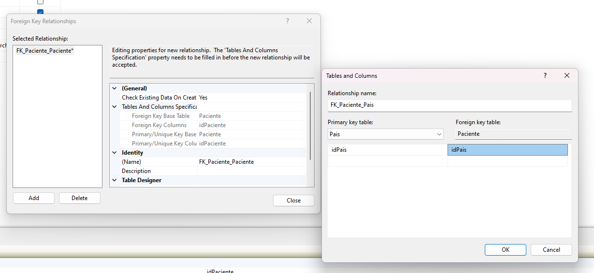

En la siguiente imagen se muestra el diagrama DER donde se evidencia cómo ambas tablas quedan ancladas con una relación. Es posible darle clic derecho sobre la línea que une las tablas y luego en *Properties*, allí se puede acceder nuevamente a la tabla de edición de la relación ingresando desde *Tables And Columns Specification* y luego en los tres puntos para entrar al cuadro de edición.

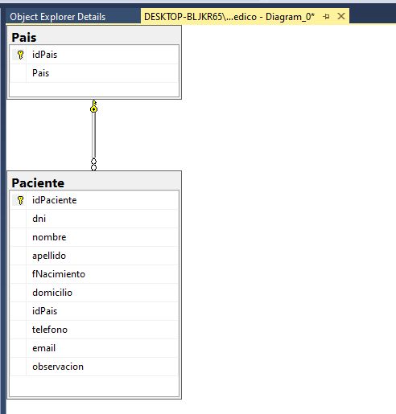

### Tipos de relaciones

[Recurso de clase](./RecursosCurso/Relaciones.pdf)

#### Uno a muchos

En la siguiente imagen, puede observarse como un lado de la flecha tiene un símbolo de llave y otro en forma de 8 o de infinito.
Esto representa una relación uno (llave) a muchos (infinito). En la tabla con la llave, existirá solo un valor que se relacionará con muchos registros en la tabla con el infinito.

- Un paciente puede pertenecer a un solo país
- Un país puede pertenecer a muchos pacientes

Otra forma de verlo es debido a que idPais en la tabla de País es una *Primary Key*, **pero** en la tabla de Paciente es una FK (*Foreign Key*), lo que genera la relación de uno a muchos.

#### Muchos a muchos

No es posible crear relaciones muchos a muchos en BD relacionales. Esto se debe a que no habría forma de crear una PK, dado que no existirían datos únicos. Es por ello, que desde BD relacionales se requiere la existencia de una tercera tabla, como en el siguiente ejemplo, donde es necesaria la creación de la tabla "MedicoEspecialidad". Esto permita al final que un medico pueda tener muchos especialidades y una especialidad pueda ser tenida por muchos médicos.

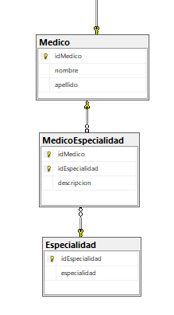

#### Uno a Uno

Para explicar esta relación, se crea una tabla de datos particulares de los pacientes. Ejm: resultados de una encuesta.

~~~
CREATE TABLE PacienteInfo(
	idPaciente paciente,
	diabetico BIT,
	implantes BIT,
	PRIMARY KEY (idPaciente)
);
~~~

Al crear la relación, esta genera en ambos lados una llave, indicando una relación 1-1 (uno a uno). Cada registro se relacionará directamente con un único registro en la otra tabla.

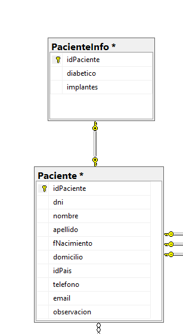

### Eliminar una relación

Es posible desde el *Object Explorer*, abrir la tabla deseada, luego en la carpeta *Keys* y en las FK que aparezcan, seleccionar y dar en la tecla Delete o en clic derecho Delete. Esto abrirá un cuadro de diálogo para proceder a eliminar la relación.
Otra forma es desde el Diagrama DER, dar clic derecho sobre la flecha de la relación y dar en *Delete Relationships from Database*, lo que abrirá el mismo cuadro de dialogo para eliminar la relación.

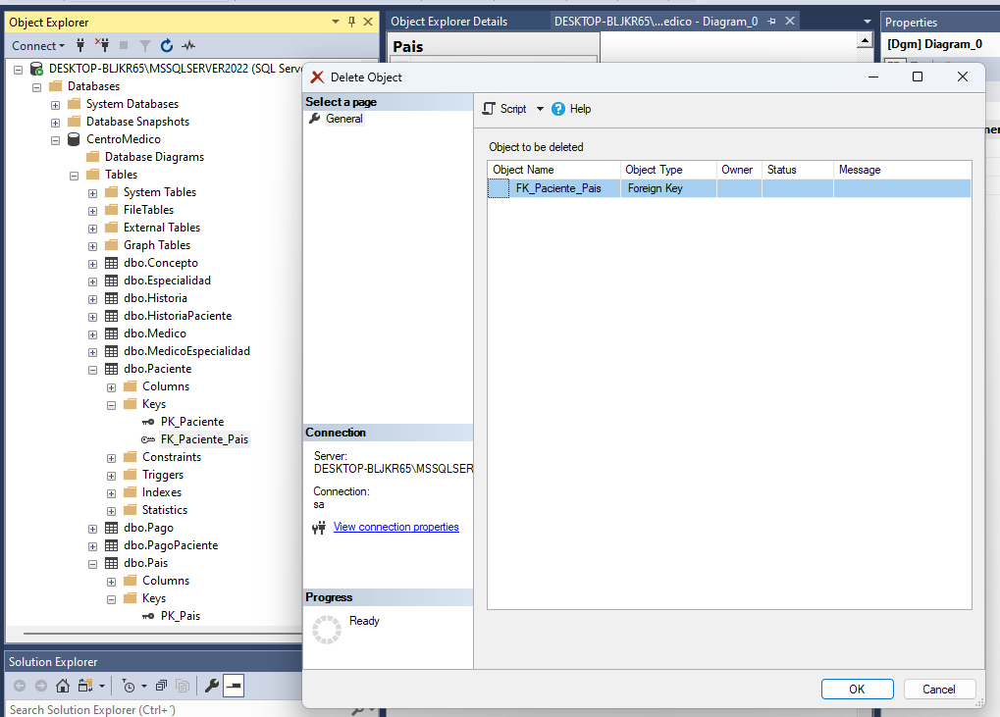

### Editar un diagrama y agregar nuevas tablas

Para editar el Diagrama previamente creado, desplegamos a carpeta Database Diagrams y con click derecho sobre el Diagrama existente seleccionamos la opción Modify

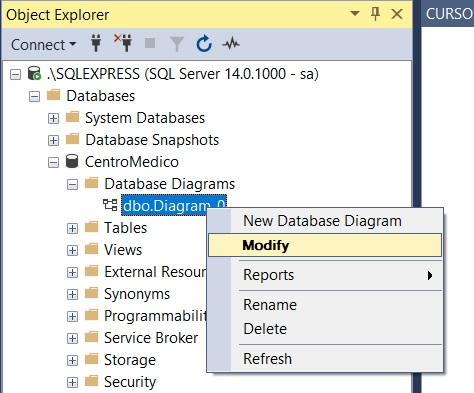

Una vez abierto el Diagrama, con click derecho sobre el fondo del mismo seleccionamos la opción Add Table

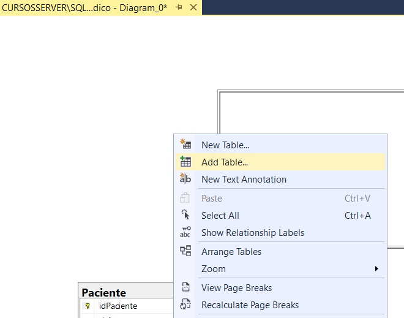

Finalmente seleccionamos de la lista, las tablas requeridas, con la tecla CTLR + Click izquierdo y presionamos el botón Add o Agregar

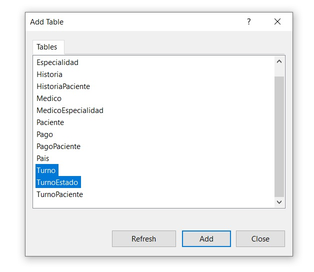

### Relación tablas intermedias

La tabla Pago Paciente se relaciona con las tablas Pago, Paciente y Turno, todas al mismo tiempo. Es por esto, que al abrir el editor de las relaciones, hacemos uso del boton *Add* hasta agregar 3 relaciones en esta tabla. En cada una, seleccionamos la tabla con que se crea la relación y, los demás campos de la tabla PagoPaciente se pasan al valor de *None*, de manera que solo se considere un valor en cada relación, como se muestra en la siguiente imagen.

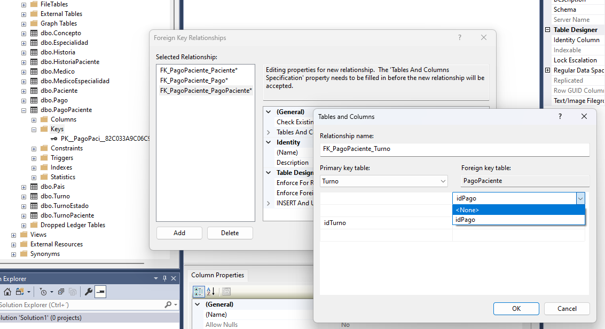

AL finalizar las relaciones, en el gráfico del DER, al dar clic derecho en el fondo del diagrama, y luego en *Arange table*, se reorganiza para verse de una forma más adecuada.

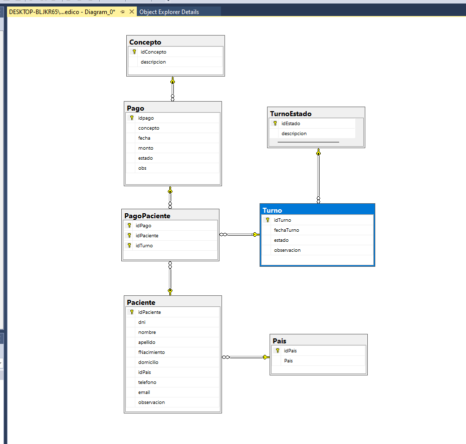

Es posible crear relaciones desde el diagrama DER.
Seleccionamos un campo con una llave y arrastramos y soltamos sobre el campo de otra tabla que queremos crear la relación. Esto despliega la tabla de edición de las relaciones.

IMPORTANTE: Guardar los cambios realizados en el diagrama DER de  manera que los cambios se puedan evidenciar.

#### EJERCICIO: Relacionar un Turno con su Estado

1. Deberás realizar la Restricción Turno y TurnoEstado entre dichas tablas con el método explicado anteriormente.
2. Los campos que debes relacionar son estado con idEstado de sus respectivas tablas.
3. Para ello deberás abrir el diagrama DER creado y agregar al mismo ambas tablas Turno y TurnoEstado para verificar que la Restricción se haya establecido correctamente.
4. Para finalizar, guarda los cambios en el diagrama.

#### EJERCICIO: Relacionar un Pago con su Concepto
1. Deberás realizar la Restricción Pago y Concepto entre dichas tablas con el método explicado anteriormente.
2. También deberás abrir el diagrama DER creado y agregar al mismo ambas tablas Pago y Concepto para verificar que la Restricción se haya establecido correctamente.
3. Para finalizar, guarda los cambios en el diagrama.

#### EJERCICIO: Relacionando una Historia Clínica con su Paciente y Médico
Deberás realizar una Restricción entre una Historia con su Paciente y su Médico con el método que prefieras.
1. Agregar al diagrama las tablas necesarias.
2. Generar las restricciones.
3. Guardar el diagrama.

#### EJERCICIO: Eliminar una Foreign Key
Siguiendo el método explicado en las clases anteriores, deberás eliminar la restricción entre la tabla Paciente y PacienteInfo.

Recuerda que la tabla PacienteInfo fué creada para citar un ejemplo de restricción y si no la tienes en tu base de datos, puedes omitir este ejercicio.

[Subir](#top)
## Sección 6. Manipulación de registros DML con INSERT y SELECT

### Añadir registros a una tabla

Clic derecho a una tabla, luego en *Edit Top 2000 rows* y se añaden los elementos y se editan los que se requieran.

Para eliminar, en la ventana de edición, se seleccionan la o las filas y luego en clic derecho *Delete* o con la tecla DEL.

Para ver una tabla, clic derecho, luego en *Select top 2000 rows* y de esta forma se crea una *New query* trayendo los 2000 primeros registros.

### SELECT

Permite seleccionar campos de una tabla basado en unas condiciones.
Se usa * para seleccionar todos los campos o se separa por ","

~~~
SELECT * FROM paciente;
SELECT idPaciente, nombre, apellido FROM paciente;
~~~

### INSERT

Permite ingresar registros desde SQL a una tabla

Los textos o VARCHAR deben ir entre comillas simples ''
Las fechas deben ir también entre comillas simples y en el formato nativo de SQL Server que es AAAA-MM-DD.
También funciona usar el formato AAAAMMDD (sin guiones medios)

~~~
-- Para un registro.
INSERT INTO Paciente (dni, nombre, apellido, fNacimiento, domicilio, idPais, telefono, email, observacion)
VALUES ('33521569', 'Leandro', 'Paredes', '1982-05-20' ,'Piedras 150', 'ARG', '001548263', 'leandro@gmail.com', '');

-- Para varios registros.
INSERT INTO Paciente (dni, nombre, apellido, fNacimiento, domicilio, idPais, telefono, email, observacion)
VALUES 
('33578126', 'José', 'Pérez', '1999-04-15' ,'Lavalle 2563', 'COL', NULL, 'jose@gmail.com', 'paciente derivado'),
('20584962', 'Marcela', 'Torres', '1978-02-15' ,'Belgrano 1563', 'MEX', 156847523, 'marcela@gmail.com', '');
~~~

INSERT no funciona si se intenta violar la condición de una tabla con PK, donde este valor debe ser único.

~~~
INSERT INTO Pais  VALUES ('ESP', 'España');

Arroja:
Msg 2627, Level 14, State 1, Line 4
Violation of PRIMARY KEY constraint 'PK_Pais'. Cannot insert duplicate key in object 'dbo.Pais'. The duplicate key value is (ESP).
The statement has been terminated.

Completion time: 2023-08-28T23:03:37.3586994-05:00
~~~

~~~
INSERT INTO TurnoEstado
VALUES
(0,'Pendiente'),
(1,'Realizado'),
(2,'Cancelado'),
(3,'Rechazado'),
(4,'Postergado'),
(5,'Anulado'),
(6,'Derivado')

-- Intentar lo siguiente generará error
INSERT INTO TurnoEstado
VALUES
(0,'Reservado')
~~~

~~~
SELECT * FROM Turno

INSERT INTO Turno (fechaTurno, estado, observacion) VALUES
('2023-03-15', 0, 'Paciente en ayunas')

SELECT * FROM Turno
SELECT * FROM Paciente
SELECT * FROM Medico

INSERT INTO TurnoPaciente VALUES
(1, 14, 1)
~~~

#### EJERCICIO: Insertar registros en las tablas Pago, PagoPaciente y Concepto

~~~
SELECT * FROM Concepto

INSERT INTO Concepto (descripcion)
VALUES ('Radiografía'), ('Laboratorio');
-----------------------------------------------------
SELECT * FROM Pago

INSERT INTO Pago (concepto, fecha, monto, estado, obs)
VALUES
(1, '2019-02-15', 4500, 0, 'Pago pendiente'),
(2, '2019-05-20', 6800, 0, 'Pago pendiente'), 
(1, '2019-09-17', 5600, 0, 'Pago pendiente')
-----------------------------------------------------
SELECT * FROM Pago
SELECT * FROM Paciente
SELECT * FROM Turno

SELECT * FROM PagoPaciente

INSERT INTO PagoPaciente VALUES
(1, 1, 1),
(2, 5, 1),
(3, 15, 1)

~~~

[Subir](#top)
## Sección 7. Cláusulas SQL

### TOP
Retorna los primeros datos de una tabla
Se puede incluir el *
~~~
SELECT TOP 2 * FROM Paciente
~~~

O se pueden especificar los campos que se quieren
~~~
SELECT TOP 2 nombre, apellido FROM Paciente
~~~

### ORDER BY
Ordena una tabla por uno o varios campos.
Por defecto ordena  de forma ASC
~~~
SELECT * FROM Paciente ORDER BY fNacimiento
~~~
Para cambiar el tipo de ordenamiento, se puede incluir al final el texto *DESC*
~~~
SELECT * FROM Paciente ORDER BY fNacimiento DESC
~~~

### TOP + ORDER BY
Permite obtener los primeros datos de una tabla que previamente considera un ordenamiento.
~~~
SELECT TOP 1 * FROM Paciente ORDER BY fNacimiento
SELECT TOP 1 * FROM Paciente ORDER BY fNacimiento DESC
~~~

### DISTINCT
Obtiene los valores únicos de un campo
~~~
SELECT DISTINCT idPais FROM Paciente
SELECT DISTINCT nombre FROM Paciente
~~~

### GROUP BY
Agrupa registros. REQUIERE de una función agregadora, que permiten hacer conteos, sumas, entre otras.

ES NECESARIO: que el campo que se agrupe, luego se pase también en el SELECT

~~~
SELECT idPais FROM Paciente GROUP BY idPais
~~~

### WHERE
Filtra/busca determinados registros que cumplan una condición.
~~~
SELECT * FROM Paciente where idPais='MEX'
SELECT * FROM Paciente where apellido='López'
~~~

[Subir](#top)
## Sección 8. Manipulación de registros DML con UPDATE y DELETE

### UPDATE
Permite actualizar registros

Se usa *SET* para actualizar determinados campos. Se separan por coma los campos

Luego de UPDATE y de SET es posible incluir la cláusula WHERE. Esto permite que no se hagan actualizaciones masivas de información y que nos enfocamos solo en los registros deseados.

~~~
-- Actualiza todos los registros en su campo "observacion"
UPDATE Paciente SET observacion = 'Sin observación'

-- Atualiza el correo solo para el idPaciente 4
UPDATE Paciente SET email = 'correo@mail.com' WHERE idPaciente = 4

-- Actualiza varios campos a la vez
UPDATE Paciente SET dni='123456789', domicilio = 'Calle El Barranco' WHERE idPaciente = 4
~~~

### DELETE
Permite eliminar registros

~~~
-- Elimina TODOS los registros de la tabla
DELETE FROM Paciente

-- Elimina solo los registros correspondientes
DELETE FROM Paciente WHERE idPaciente=6
~~~

#### DELETE Y FOREIGN KEYS

~~~
DELETE FROM Paciente WHERE idPaciente = 14
~~~

Al ejecutar la consulta arroja el siguiente error.
Esto previene dejar registros inconsistentes en la base de datos.
Si se borra un registro en este caso, todos los registros compartidos por FOREIGN KEYS

~~~
Msg 547, Level 16, State 0, Line 13
The DELETE statement conflicted with the REFERENCE constraint "FK_TurnoPaciente_Paciente". The conflict occurred in database "CentroMedico", table "dbo.TurnoPaciente", column 'idPaciente'.
The statement has been terminated.
~~~

En este caso, primero se debe eliminar el registro en la tabla TurnoPaciente y luego en Paciente

~~~
DELETE FROM TurnoPaciente WHERE idTurno=2
DELETE FROM Paciente WHERE idPaciente=14
~~~

Dado que la tabla Turno tiene información adicional a la tabla TurnoPaciente, es importante que se elimine el registro correspondiente en la tabla Turno, de manera que todos los registros sean consistentes.
~~~
DELETE FROM TurnoPaciente WHERE idTurno=2
~~~

### Propiedad ALLOW NULLS

Esta propiedad, al estar activada (True, Yes, 1), permite que un campo pueda ser diligenciada con valores NULL.
Cuando está en desactivada (False, No, 0), no permite campos NULL. 
Al intentar crear un nuevo registro en este caso, el programa arroja el siguiente error
~~~
SELECT * FROM Medico
INSERT INTO Medico VALUES (NULL, NULL)
~~~

~~~
Msg 515, Level 16, State 2, Line 4
Cannot insert the value NULL into column 'nombre', table 'CentroMedico.dbo.Medico'; column does not allow nulls. INSERT fails.
The statement has been terminated.
~~~

[Subir](#top)
## Sección 9. Ejercicios Complementarios
~~~
-- Insetar en TurnoEstado para validar IDENTITY
SELECT * FROM TurnoEstado
INSERT INTO TurnoEstado VALUES ('Preparado'), ('Diseñado'), ('Ahorrado')
-- Pago ordenado por fecha
SELECT * FROM Pago
SELECT * FROM Pago ORDER BY fecha
-- Paciente más joven
SELECT * FROM Paciente
SELECT TOP 1 * FROM Paciente ORDER BY fNacimiento DESC
~~~

[Subir](#top)
## Sección 10. Funciones de Agregado

### MAX Y MIN
Se pueden usar  en campos tipo VARCHAR, donde retorna resultados por orden alfabético.

~~~
SELECT * FROM Pago
SELECT MAX(fecha) FROM Pago
SELECT MIN(monto) FROM Pago
~~~

### SUM
Estas operaciones generan un campo sin nombre. Es posible crear un nuevo nombre luego de hacer la operación.
SQL permite operaciones matemáticas.
~~~
SELECT * FROM Pago
SELECT SUM(monto) MONTOTOTAL FROM Pago
SELECT SUM(monto) AS MONTOTOTAL FROM Pago
SELECT SUM(monto + 20) AS MONTOTOTAL FROM Pago
SELECT SUM(monto)+20 AS MONTOTOTAL FROM Pago
~~~

### AVG
~~~
SELECT * FROM Pago
SELECT AVG(MONTO) FROM Pago
~~~

### COUNT
~~~
SELECT COUNT(idPaciente) FROM Paciente
SELECT * FROM Paciente
SELECT COUNT(idPaciente) FROM Paciente WHERE apellido='López'
~~~

### HAVING
Having "donde el valor sea". Requiere incluir GROUPBY e incluir COUNT
Similar a Where
Where -> Filtra sobre un registro particular
Having -> Filtra sobre un conjunto de registros

ES NECESARIO, que el campo por el que se hace el GROUPBY, se incluya en el HAVING

Having permite incluir funciones como el COUNT para poder así seleccionar pero con una condición previa de conteo

Como ejemplo, sobre esta tabla Turno. Se insertan varios registros para probar la función HAVING:
~~~
SELECT * FROM Turno
INSERT INTO TURNO VALUES ('20190101', 3, 'OBS3')
~~~

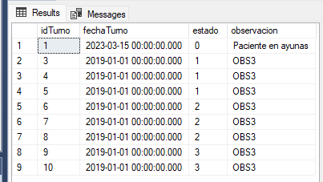

Se incluye el HAVING, pero donde Estado=1 (En este caso, funciona como un WHERE)
~~~
SELECT estado FROM Turno GROUP BY estado HAVING estado = '1'
~~~

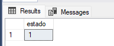

Se incluye el HAVING, incluyendo el COUNT. En este caso, ya se diferencia del WHERE. Trae todos los registros que cumplan la condición que al realizar un GROUPBY y contar registros, estos sean <4.

~~~
SELECT estado FROM Turno GROUP BY estado HAVING COUNT(estado) < 4
~~~

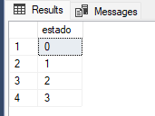

Y con el conteo < 3:
~~~
SELECT estado FROM Turno GROUP BY estado HAVING COUNT(estado) < 3
~~~

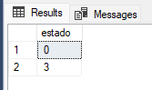

[Subir](#top)
## Sección 11. Operadores Lógicos

### AND
Concatena varias condiciones en la que todas deben ser verdaderas para poder obtener datos en un SELECT.
~~~
-- Incluimos un paciente con el mismo nombre y apellido que uno existente
INSERT INTO Paciente VALUES ('Jorge', 'Ramírez', '2018-03-27', 'El Barranco', 'MEX', NULL, 'jorge@mail.com.co', NULL)
SELECT * FROM Paciente
~~~
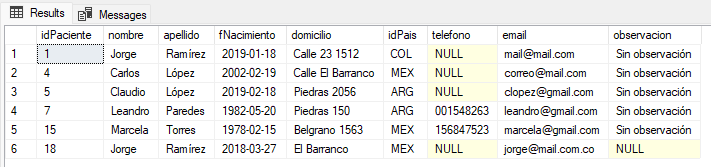
~~~
--Usamos el AND
SELECT * FROM Paciente WHERE nombre='Jorge' AND apellido='Ramírez'
~~~
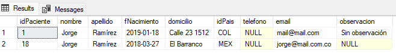
~~~
SELECT * FROM Paciente WHERE nombre='Jorge' AND apellido='Ramírez' AND idPaciente=18
~~~
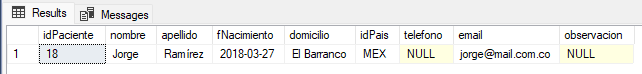

### OR
Concatena varias condiciones en la que **por lo menos 1** debe ser verdadera para poder obtener datos en un SELECT.
~~~
INSERT INTO Paciente VALUES ('Jaime', 'Ramírez', '2018-03-27', 'El Barranco', 'MEX', NULL, 'otro@mail.com.co', NULL)
INSERT INTO Paciente VALUES ('Jorge', 'Perez',   '2018-03-27', 'El Barranco', 'MEX', NULL, 'otro@mail.com.co', NULL)
SELECT * FROM Paciente
~~~
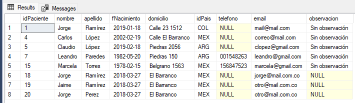
~~~
SELECT * FROM Paciente WHERE nombre='Jorge' OR apellido='Ramírez' OR idPaciente=18
~~~
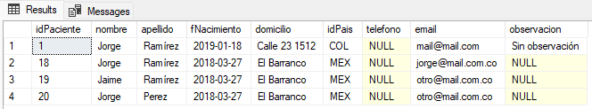

### IN
Permite realiza un filtrado de acuerdo con los valores que pasamos en una lista entre paréntesis luego de incluir el IN y luego de un WHERE:

~~~
SELECT * FROM Turno WHERE ESTADO IN(2,3)

SELECT * FROM Paciente WHERE apellido IN('López', 'Pérez', 'Osorio')
~~~

### LIKE
Permite realiza un filtrado de registpros **similares** de acuerdo con lo que pasamos en una cadena luego de incluir el LIKE y luego de un WHERE.
Es importante incluir los comodínes % antes, despúes o en ambos lados de una cadena:

~~~
SELECT * FROM Paciente
SELECT * FROM Paciente WHERE nombre LIKE 'J%'
SELECT * FROM Paciente WHERE apellido LIKE '%ez'
SELECT * FROM Paciente WHERE nombre LIKE '%d%'
~~~

### NOT
Niega una condición
Puede usarse en un LIKE, en un IN, etc.

~~~
SELECT * FROM Paciente
SELECT * FROM Paciente WHERE nombre NOT LIKE 'J%'
SELECT * FROM Paciente WHERE apellido NOT IN('López', 'Pérez', 'Osorio')
~~~

### BETWEEN
Filtra por un rango (fechas, números, textos)
CUIDADO: Es importante incluir las **HORAS**, en caso que el formato *datetime* incluya la hora.

~~~
-- Por fechas
SELECT * FROM TURNO
UPDATE TURNO SET fechaTurno='20190101 1:00:00' WHERE idTurno=3
UPDATE TURNO SET fechaTurno='20190101 2:00:00' WHERE idTurno=4
UPDATE TURNO SET fechaTurno='20190101 3:00:00' WHERE idTurno=5
UPDATE TURNO SET fechaTurno='20190101 4:00:00' WHERE idTurno=6
UPDATE TURNO SET fechaTurno='20190101 5:00:00' WHERE idTurno=7
UPDATE TURNO SET fechaTurno='20190101 6:00:00' WHERE idTurno=8
SELECT * FROM TURNO WHERE fechaTurno BETWEEN '20190101 00:00:00' AND '20190101 05:00:00'
~~~

~~~
-- Por números
SELECT * FROM TURNO WHERE estado BETWEEN 1 AND 2
~~~

### Combinación de operadores
Es posible combinar los operadores
PRECAUCIÓN: El uso de Paréntesis () es importante.

~~~
SELECT * FROM Paciente 
SELECT * FROM Paciente WHERE nombre='Jorge' OR apellido='Ramírez' 
SELECT * FROM Paciente WHERE nombre='Jorge' OR apellido='Ramírez' OR idPais = 'ARG'
SELECT * FROM Paciente WHERE nombre='Jorge' AND (apellido='Ramírez' OR idPais = 'ARG')
SELECT * FROM Paciente WHERE nombre='Jorge' AND idPaciente NOT IN(3,6, 18)
~~~

[Subir](#top)
## Sección 12. Stored Procedures, Variables y Subconsultas

### Stored Procedures

Es un procedimiento que queda "instalado" en el SQL para ser usado cuando se requiera.
Se abre una solución y un proyecto dentro. Allí, se crea un *New Query* para poder crea un STORE PROCEDURE.

Están destinados para ejecutar consultas concretas.
Permiten
Un *Store Procedure* tiene un objetivo determinado. Esto puede ser INSERT, DELETE, UPDATE, o varios o todos al mismo tiempo.
Es un símil a ***FUNCIONES***.

Los parámetros de entrada se incluyen dentro del paréntesis y requieren un @ delante.

~~~
-- EJM de CREAR un STORE PROCEDURE
CREATE PROC S_paciente(@idpaciente INT)
AS
SELECT * FROM Paciente WHERE idPaciente=@idpaciente
GO
~~~

Al ejecutarlo con F5, se guardan automáticamente en la ruta de la base de datos ./Programmability/StoredProcedures.

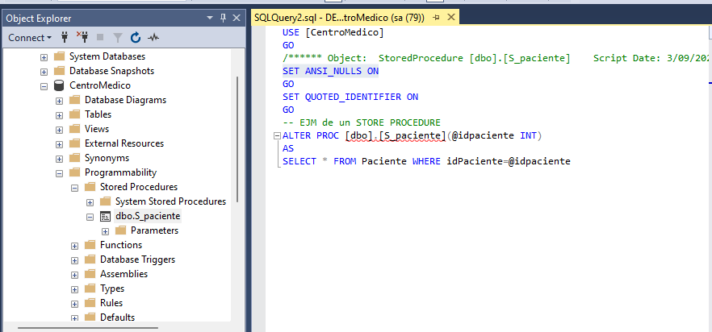

De forma automática, SQL Server incluye otros ítems que son:
- NO considerar los valores NULL. Si se desea que se consideren los valores NULL, se debe cambiar por la cláusula SET ANSI_NULLS OFF.

~~~
SET ANSI_NULLS ON
~~~

- Permita usar las palabras reservadas como NULL, WHERE, IN, SELECT, entre otras, **SIEMPRE Y CUANDO** se incluyan las comillas dobles "". 

~~~
SET QUOTED_IDENTIFIER ON
~~~

Antes de incluir las dobles comillas, se resaltan las palabras reservadas y mal usadas con líneas rojas.

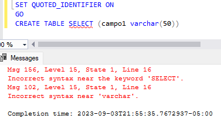

Al incluir las dobles comillas, se permite el uso de las palabras reservadas sin error

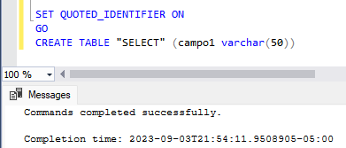

Al dar clic derecho y MODIFY a un *Stored Procedure* (SP), se abre una ventana de consulta con la palabra **ALTER** para determinar que el SP ya está creado y lo que continúa es una MODIFICACIÓN.

Para ejecutar un SP, se una ventana de *New Query*, se ejecutar una línea de la siguiente forma:
~~~
EXEC nombre_del_SP param1, param2, param3

-- Para el ejemplo sería:
SELECT * FROM Paciente
EXEC S_paciente 3
EXEC S_paciente 99
EXEC S_paciente 19
~~~

### Variables

Es un objeto en memoria que permite almacenar un valor. Sobrevive durante todo un Script y su valor puede variar.
Para definirlo, se usan las palabras DECLARE y el símbolo @:
~~~
DECLARE @ordenamiento VAR(1)
SET @ordenamiento = 'A'
~~~

Para definirlo e inicializarlo de una vez:
~~~
DECLARE @ordenamiento VAR(1) = 'A'
~~~

#### Print
Permite escribir en la consola el valor de una variable o algún mensaje que queremos ver en la ejecución de un Script:
~~~
PRINT 'Hola Mundo'
PRINT 123
PRINT @miVariable
~~~

#### ISNULL
Permite ajustar el valor de una variable o de una expresión, cuando esta es NULL.
El siguiente código, imprime VACÍO:
~~~
DECLARE @ordenamiento CHAR(1)
DECLARE @valorOrdenamiento CHAR(1)
SET @valorOrdenamiento = @ordenamiento
PRINT @valorOrdenamiento
~~~
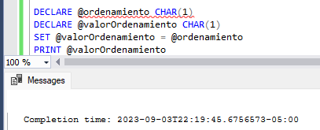

Mientras el siguiente código, imprime una 'A'
~~~
DECLARE @ordenamiento CHAR(1)
DECLARE @valorOrdenamiento CHAR(1)
SET @valorOrdenamiento = ISNULL(@ordenamiento, 'A')
PRINT @valorOrdenamiento
~~~

#### Ejemplos para declarar Variables de distintos Tipos de Dato
Estos son algunos ejemplos sobre cómo declarar Variables de distintos Tipos de Datos y evaluar valores Nulos:

~~~
DECLARE @entero INT
SET @entero = NULL
SELECT ISNULL(@entero, 0) AS Valor

DECLARE @decimal DECIMAL(10,2)
SET @decimal = NULL
SELECT ISNULL(@decimal, 0.00) AS Valor

DECLARE @cadena VARCHAR(50)
SET @cadena = NULL
SELECT ISNULL(@cadena, 'Texto predeterminado') AS Valor

DECLARE @fecha DATETIME
SET @fecha = NULL
SELECT ISNULL(@fecha, GETDATE()) AS Valor

DECLARE @booleano BIT
SET @booleano = NULL
SELECT ISNULL(@booleano, 0) AS Valor

DECLARE @moneda MONEY
SET @moneda = NULL
SELECT ISNULL(@moneda, 0.00) AS Valor
~~~

### SUBCONSULTAS y ALIAS
Se trata de un SELECT dentro de otro SELECT.
Los ALIAS permiten darle nombre a cada tabla de una consulta. En el siguiente ejemplo, los ALIAS "ps" y "pa". Este alias permite que la subconsulta (que está entre paréntesis) pueda traer un **único campo** de País, permitiendo igualar los PK: ps.idPais = pa.idPais

~~~
SELECT apellido, nombre, idPais, observacion,
	(SELECT Pais FROM Pais ps WHERE ps.idPais = pa.idPais) descPais
FROM Paciente pa
~~~

Fuera de la SUBCONSULTA, se incluye el nombre de la columna que arroja *descPais*, de manera que esta tenga un nombre.

[Subir](#top)
## Sección 13. Estructuras de Control
Permiten evaluar condiciones y tomar decisiones

### IF-ELSE y BEGIN-END
Un condicional IF debe incluir dentro, cuando tiene más de una instrucción, un BEGIN-END para dar a entender todas las intrucciones que se deben de considerar.

El siguiente código solo ejecutará, cuando el IF es verdadero, la primera línea "SELECT * FROM Paciente WHERE idPaciente=@IDPACIENTE".
~~~
DECLARE @IDPACIENTE INT
DECLARE @IDTURNO INT

SET @IDPACIENTE = 7

IF @IDPACIENTE = 7
	SET @IDTURNO = 20
	SELECT * FROM Paciente WHERE idPaciente=@IDPACIENTE
	PRINT @IDTURNO
~~~

Es por esto que debe incluirse un BEGIN-END
~~~
DECLARE @IDPACIENTE INT
DECLARE @IDTURNO INT

SET @IDPACIENTE = 7

IF @IDPACIENTE = 7
BEGIN
	SET @IDTURNO = 20
	SELECT * FROM Paciente WHERE idPaciente=@IDPACIENTE
	PRINT @IDTURNO
END
~~~

Para incorporar un ELSE, para cuando no se cumpla la condición:
~~~
DECLARE @IDPACIENTE INT
DECLARE @IDTURNO INT

SET @IDPACIENTE = 7

IF @IDPACIENTE = 7
	BEGIN
		SET @IDTURNO = 20
		SELECT * FROM Paciente WHERE idPaciente=@IDPACIENTE
		PRINT @IDTURNO
	END
ELSE
	BEGIN
		PRINT 'No se cumplió la condición'
	END
~~~

### EXISTS()
Retorna VERDADERO o FALSO, dependiendo si existe o no, o si retorna o no, registros una consulta.

~~~
DECLARE @IDPACIENTE INT
DECLARE @IDTURNO INT

SET @IDPACIENTE = 7

IF @IDPACIENTE = 7
	BEGIN
		SET @IDTURNO = 20
		SELECT * FROM Paciente WHERE idPaciente=@IDPACIENTE
		PRINT @IDTURNO
		IF EXISTS(SELECT * FROM Paciente WHERE idPaciente=4)
			PRINT 'Existe'
	END
~~~

### WHILE
Repetir hasta que se cumpla una condición
~~~
DECLARE @CONTADOR INT = 0
WHILE @CONTADOR <= 10
BEGIN
	PRINT @CONTADOR
	SET @CONTADOR = @CONTADOR + 1
END
~~~

### CASE
Bloque de la forma CASE-ELSE-END

~~~
DECLARE @VALOR INT
DECLARE @RESULTADO CHAR(10)=''
SET @VALOR = 20

SET @RESULTADO = (
	CASE
		WHEN @VALOR = 10 THEN 'ROJO'
		WHEN @VALOR = 20 THEN 'VERDE'
		WHEN @VALOR = 30 THEN 'AZUL'
		WHEN @VALOR = 10 THEN 'ROJO'
		ELSE 'GRIS'
	END
)
PRINT @RESULTADO
~~~

Puede usarse en un SELECT:
~~~
SELECT *, (CASE WHEN estado=1 THEN 'VERDE'
			    WHEN estado=2 THEN 'ROJO'
				WHEN estado=3 THEN 'AZUL'
		   ELSE 'GRIS'
		   END) as COLORTURNO FROM TURNO
~~~

### RETURN-BREAK
Return: sale del código a la consola. No continúa le ejecución.
~~~
DECLARE @CONTADOR INT = 0
WHILE @CONTADOR <= 10
BEGIN
	PRINT @CONTADOR
	SET @CONTADOR = @CONTADOR + 1
	IF @CONTADOR = 3
		RETURN
	PRINT 'HOLA1'
END
PRINT 'HOLA2'
~~~
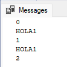

Break: Sale del bucle en que esté (o de la estructura de control donde esté)
~~~
DECLARE @CONTADOR INT = 0
WHILE @CONTADOR <= 10
BEGIN
	PRINT @CONTADOR
	SET @CONTADOR = @CONTADOR + 1
	IF @CONTADOR = 3
		BREAK
	PRINT 'HOLA1'
END
PRINT 'HOLA2'
~~~
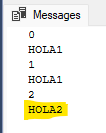

### TRY-CATCH
Permite maneja de errores en tiempo de ejecución. Errores no controlados, comúnmente.
Requiere un primer bloque BEGIN TRY - END TRY, para que encuentre el error
Luego, requiere otro bloque BEGIN CATCH-END CATCH, para que haga el manejo correspondiente.

Un ejemplo:
~~~
DECLARE @CONTADOR INT = 0
WHILE @CONTADOR <= 10
BEGIN
	PRINT @CONTADOR
	SET @CONTADOR = @CONTADOR + 1
	IF @CONTADOR = 3
		BREAK
	--PRINT 'HOLA1'
END
PRINT 'HOLA2'

-- UN ERROR en tiempo de ejecución (CONTADOR es un INT)
SET @CONTADOR = 'Prueba'

/*
Msg 245, Level 16, State 1, Line 124
Conversion failed when converting the varchar value 'Prueba' to data type int.
*/
~~~

Se soluciona de la siguiente forma
~~~
DECLARE @CONTADOR INT = 0
WHILE @CONTADOR <= 10
BEGIN
	PRINT @CONTADOR
	SET @CONTADOR = @CONTADOR + 1
	IF @CONTADOR = 3
		BREAK
	--PRINT 'HOLA1'
END
PRINT 'HOLA2'

BEGIN TRY
	SET @CONTADOR = 'Prueba'
END TRY

BEGIN CATCH
	PRINT 'No es posible asignar un texto a la variable @CONTADOR'
END CATCH
~~~
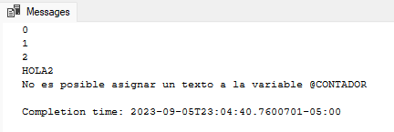

[Subir](#top)
## Sección 14. Operadores aritméticos y de comparación